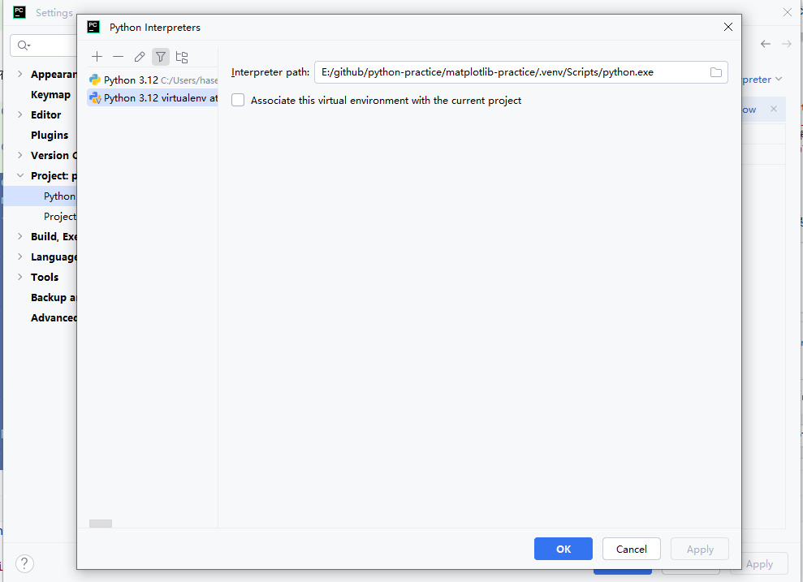

新建干净的虚拟环境


pycharm激活虚拟环境并使用虚拟环境下的pip

```shell
cd E:\github\python-practice\matplotlib-practice\.venv\Scripts
E:\github\python-practice\matplotlib-practice\.venv\Scripts>activate.bat

```

pip升级
```shell

(.venv) E:\github\python-practice\matplotlib-practice\.venv\Scripts>pip list
Fatal error in launcher: Unable to create process using '"E:\github\python-practice\matplotlib\.venv\Scripts\python.exe"  "E:\github\python-practice\matplotlib\.venv\Scripts\pip.exe" list': ???????????

(.venv) E:\github\python-practice\matplotlib-practice\.venv\Scripts>python -m pip install -U pip
Looking in indexes: https://pypi.mirrors.ustc.edu.cn/simple
Requirement already satisfied: pip in e:\github\python-practice\matplotlib-practice\.venv\lib\site-packages (23.2.1)
Collecting pip
  Downloading https://mirrors.ustc.edu.cn/pypi/packages/c9/bc/b7db44f5f39f9d0494071bddae6880eb645970366d0a200022a1a93d57f5/pip-25.0.1-py3-none-any.whl (1.8 MB)
     ━━━━━━━━━━━━━━━━━━━━━━━━━━━━━━━━━━━━━━━━ 1.8/1.8 MB 2.9 MB/s eta 0:00:00
Installing collected packages: pip
  Attempting uninstall: pip
    Found existing installation: pip 23.2.1
    Uninstalling pip-23.2.1:
      Successfully uninstalled pip-23.2.1
Successfully installed pip-25.0.1

(.venv) E:\github\python-practice\matplotlib-practice\.venv\Scripts>pip list                     
Package Version
------- -------
pip     25.0.1
```
将依赖安装至当前的虚拟局部环境
```shell
(.venv) E:\github\python-practice\matplotlib-practice\.venv\Scripts>pip install matplotlib

(.venv) E:\github\python-practice\matplotlib-practice\.venv\Scripts>pip install numpy pandas scipy

(.venv) E:\github\python-practice\matplotlib-practice\.venv\Scripts>pip list               
Package         Version
--------------- -----------
contourpy       1.3.1
cycler          0.12.1
fonttools       4.56.0
kiwisolver      1.4.8
matplotlib      3.10.1
numpy           2.2.3
packaging       24.2
pandas          2.2.3
pillow          11.1.0
pip             25.0.1
pyparsing       3.2.1
python-dateutil 2.9.0.post0
pytz            2025.1
scipy           1.15.2
six             1.17.0
tzdata          2025.1


```

最后记得切换你的python环境为当前的虚拟环境，而不是全局环境


